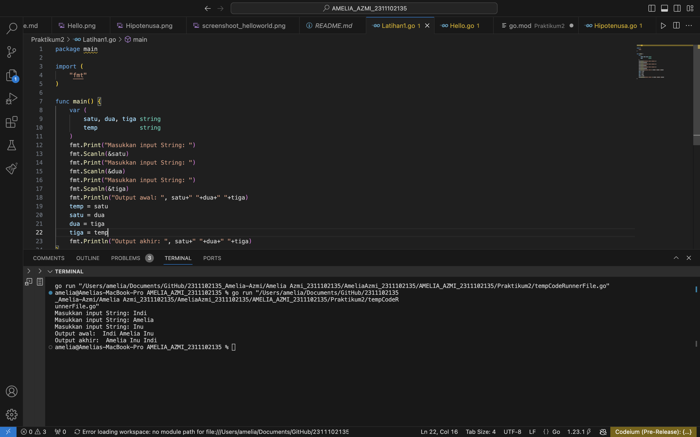
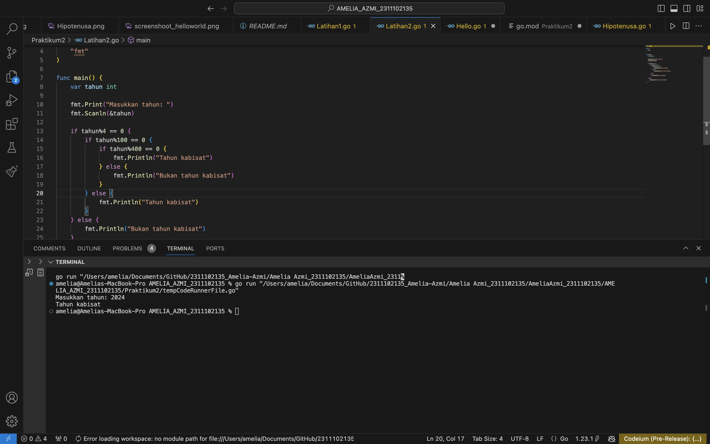
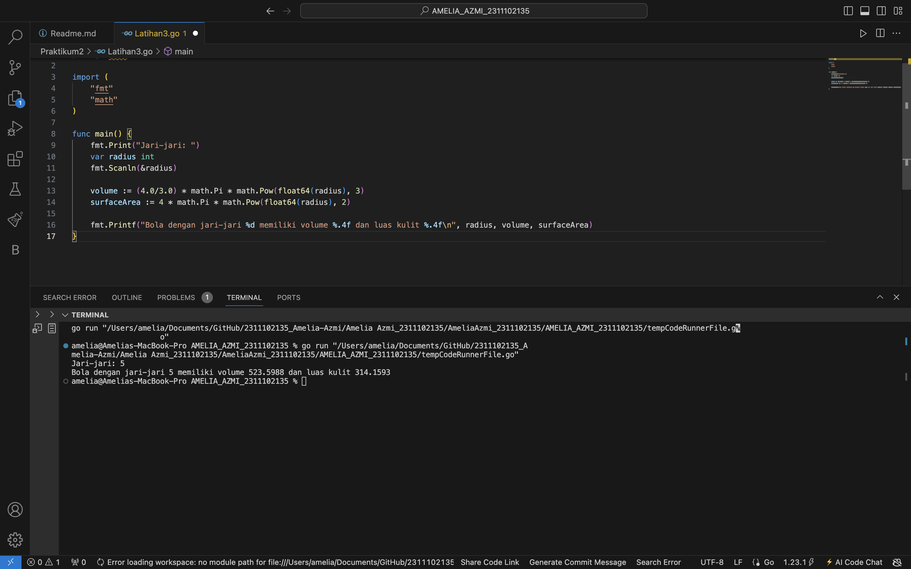
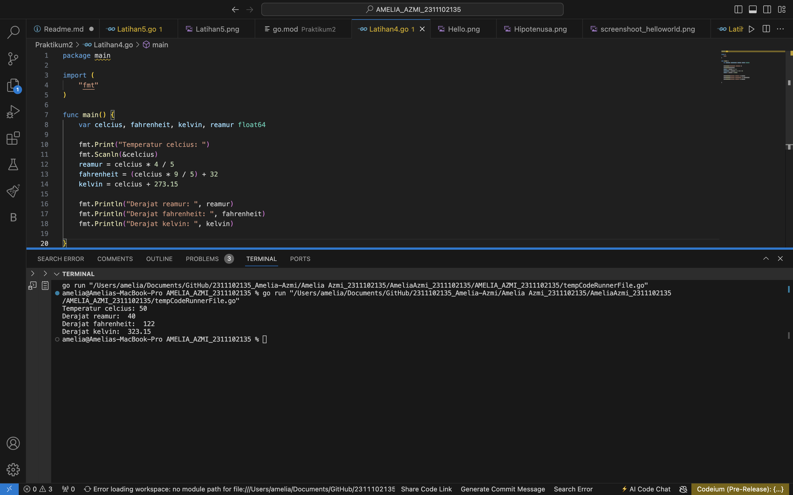
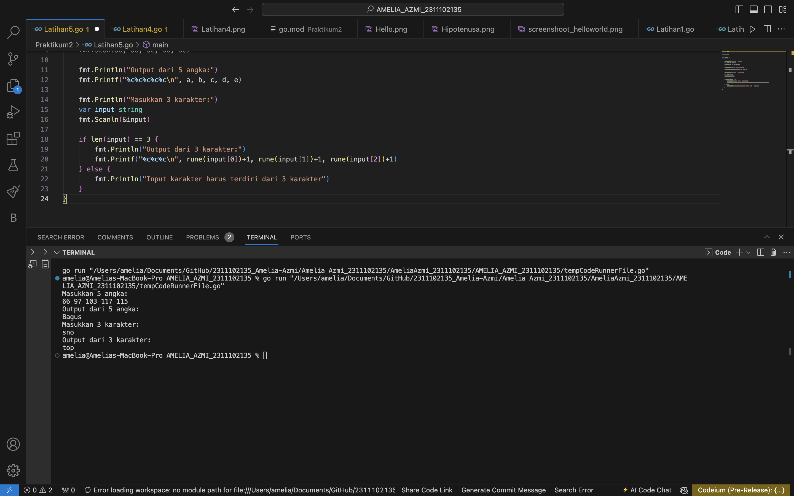

# <h1 align="center">Laporan Praktikum 2 "Riview Struktur Kontrol" </h1>
<p align="center">Amelia Azmi - 2311102135</p>


## Hello World

```go
package main

import (
	"fmt"
)

func main() {
	fmt.Println("Hello, World!")
	var greetings string = "Selamat datang di dunia go!"
	var a, b int

	fmt.Println(greetings)
	fmt.Scanln(&a, &b)
	fmt.Printf("%v + %v = %v\n", a, b, a+b)
}

```

### Output:


## Hipotenusa

```go
package main

import (
	"fmt"
)

func main() {
	var a, b, c float64
	var hipotenusa bool

	fmt.Print("Masukkan nilai A: ")
	fmt.Scanln(&a)
	fmt.Print("Masukkan nilai B: ")
	fmt.Scanln(&b)
	fmt.Print("Masukkan nilai C: ")
	fmt.Scanln(&c)
	hipotenusa = (c * c) == (a*a + b*b)
	fmt.Println("Sisi c adalah hipotenusa segitiga a, b, c: ", hipotenusa)
}

```

### Output:


## Latihan 1

```go
package main

import (
	"fmt"
)

func main() {
	var (
		satu, dua, tiga string
		temp            string
	)
	fmt.Print("Masukkan input String: ")
	fmt.Scanln(&satu)
	fmt.Print("Masukkan input String: ")
	fmt.Scanln(&dua)
	fmt.Print("Masukkan input String: ")
	fmt.Scanln(&tiga)
	fmt.Println("Output awal: ", satu+" "+dua+" "+tiga)
	temp = satu
	satu = dua
	dua = tiga
	tiga = temp
	fmt.Println("Output akhir: ", satu+" "+dua+" "+tiga)
}

```

### Output:



## Latihan 2

```go
package main

import (
	"fmt"
)

func main() {
	var tahun int

	fmt.Print("Masukkan tahun: ")
	fmt.Scanln(&tahun)

	if tahun%4 == 0 {
		if tahun%100 == 0 {
			if tahun%400 == 0 {
				fmt.Println("Tahun kabisat")
			} else {
				fmt.Println("Bukan tahun kabisat")
			}
		} else {
			fmt.Println("Tahun kabisat")
		}
	} else {
		fmt.Println("Bukan tahun kabisat")
	}
}
```

### Output:



## Latihan 3

```go
package main

import (
	"fmt"
	"math"
)

func main() {
	fmt.Print("Jari-jari: ")
	var radius int
	fmt.Scanln(&radius)

	volume := (4.0/3.0) * math.Pi * math.Pow(float64(radius), 3)
	surfaceArea := 4 * math.Pi * math.Pow(float64(radius), 2)

	fmt.Printf("Bola dengan jari-jari %d memiliki volume %.4f dan luas kulit %.4f\n", radius, volume, surfaceArea)
}
```

### Output:



## Latihan 4

```go
package main

import (
	"fmt"
)

func main() {
	var celcius, fahrenheit, kelvin, reamur float64

	fmt.Print("Temperatur celcius: ")
	fmt.Scanln(&celcius)
	reamur = celcius * 4 / 5
	fahrenheit = (celcius * 9 / 5) + 32
	kelvin = celcius + 273.15

	fmt.Println("Derajat reamur: ", reamur)
	fmt.Println("Derajat fahrenheit: ", fahrenheit)
	fmt.Println("Derajat kelvin: ", kelvin)

}
```

### Output:



## Latihan 5

```go
package main

import "fmt"

func main() {

	fmt.Println("Masukkan 5 angka:")
	var a, b, c, d, e int
	fmt.Scan(&a, &b, &c, &d, &e)

	fmt.Println("Output dari 5 angka:")
	fmt.Printf("%c%c%c%c%c\n", a, b, c, d, e)

	fmt.Println("Masukkan 3 karakter:")
	var input string
	fmt.Scanln(&input)

	if len(input) == 3 {
		fmt.Println("Output dari 3 karakter:")
		fmt.Printf("%c%c%c\n", rune(input[0])+1, rune(input[1])+1, rune(input[2])+1)
	} else {
		fmt.Println("Input karakter harus terdiri dari 3 karakter")
	}
}
```

### Output:




