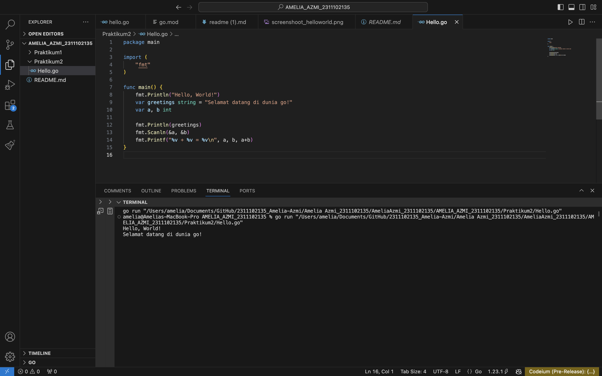

# <h1 align="center">Laporan Praktikum 2</h1>
<p align="center">Amelia Azmi - 2311102135</p>


### Hello World

```go
package main

import (
	"fmt"
)

func main() {
	fmt.Println("Hello, World!")
	var greetings string = "Selamat datang di dunia go!"
	var a, b int

	fmt.Println(greetings)
	fmt.Scanln(&a, &b)
	fmt.Printf("%v + %v = %v\n", a, b, a+b)
}

```

#### Output:



### Hipotenusa

```go
package main

import (
	"fmt"
)

func main() {
	var a, b, c float64
	var hipotenusa bool

	fmt.Print("Masukkan nilai A: ")
	fmt.Scanln(&a)
	fmt.Print("Masukkan nilai B: ")
	fmt.Scanln(&b)
	fmt.Print("Masukkan nilai C: ")
	fmt.Scanln(&c)
	hipotenusa = (c * c) == (a*a + b*b)
	fmt.Println("Sisi c adalah hipotenusa segitiga a, b, c: ", hipotenusa)
}

```

#### Output:

