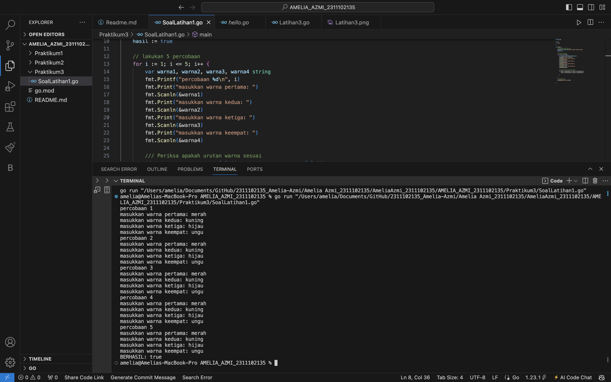
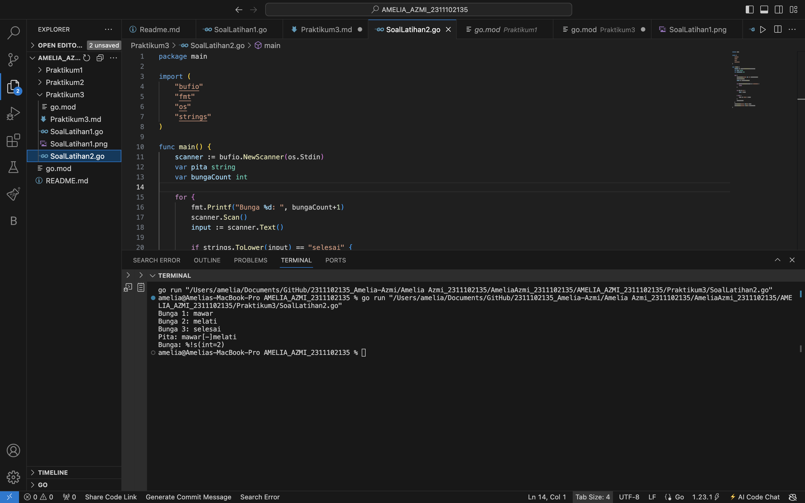
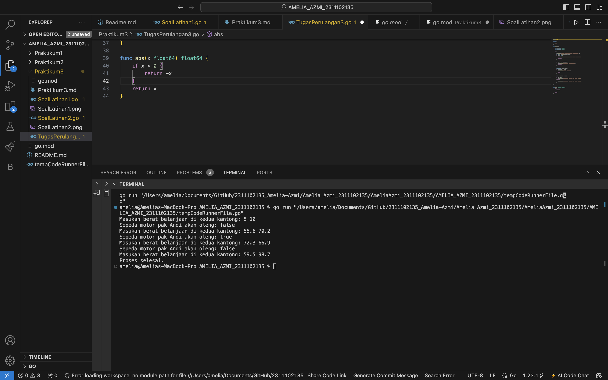
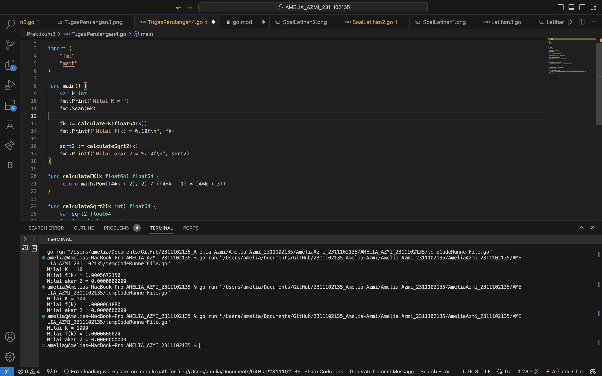

# <h1 align="center">Laporan Praktikum 3 "Riview Struktur Kontrol" </h1>
<p align="center">Amelia Azmi - 2311102135</p>


# LATIHAN

## Latihan1

```go
package main

import (
	"fmt"
)

func main() {
	// Definisikan wrana yang benar
	urutanBenar := []string{"merah", "kuning", "hijau", "ungu"}
	hasil := true

	// lakukan 5 percobaan
	for i := 1; i <= 5; i++ {
		var warna1, warna2, warna3, warna4 string
		fmt.Printf("percobaan %d\n", i)
		fmt.Print("masukkan warna pertama: ")
		fmt.Scanln(&warna1)
		fmt.Print("masukkan warna kedua: ")
		fmt.Scanln(&warna2)
		fmt.Print("masukkan warna ketiga: ")
		fmt.Scanln(&warna3)
		fmt.Print("masukkan warna keempat: ")
		fmt.Scanln(&warna4)

		/// Periksa apakah urutan warna sesuai
		if warna1 != urutanBenar[0] || warna2 != urutanBenar[1] ||
			warna3 != urutanBenar[2] || warna4 != urutanBenar[3] {

		}

	}
	// Tampilkan hasil
	fmt.Println("BERHASIL:", hasil)

}
```

### Output:



## Latihan2

```go
package main

import (
	"bufio"
	"fmt"
	"os"
	"strings"
)

func main() {
	scanner := bufio.NewScanner(os.Stdin)
	var pita string
	var bungaCount int

	for {
		fmt.Printf("Bunga %d: ", bungaCount+1)
		scanner.Scan()
		input := scanner.Text()

		if strings.ToLower(input) == "selesai" {
			break
		}

		if pita == "" {
			pita = input

		} else {
			pita += "[-]" + input
		}
		bungaCount++
	}
	fmt.Printf("Pita: %s\n", pita)
	fmt.Printf("Bunga: %s\n", bungaCount)
}

```

### Output:



# PERULANGAN

## TugasPerulangan3

```go
package main

import (
	"fmt"
)

func main() {
	var left, right float64
	var totalWeight float64

	for {
		fmt.Print("Masukan berat belanjaan di kedua kantong: ")
		_, err := fmt.Scan(&left, &right)
		if err != nil {
			fmt.Println("Invalid input. Please enter two numbers.")
			continue
		}

		if left < 0 || right < 0 {
			fmt.Println("Berat tidak boleh negatif.")
			continue
		}

		totalWeight = left + right
		if totalWeight > 150 {
			fmt.Println("Proses selesai.")
			break
		}

		diff := abs(left - right)
		if diff >= 9 {
			fmt.Printf("Sepeda motor pak Andi akan oleng: true\n")
		} else {
			fmt.Printf("Sepeda motor pak Andi akan oleng: false\n")
		}
	}
}

func abs(x float64) float64 {
	if x < 0 {
		return -x
	}
	return x
}

```

### Output:



## 

```go
package main

import (
	"fmt"
	"math"
)

func main() {
	var k int
	fmt.Print("Nilai K = ")
	fmt.Scan(&k)

	fk := calculateFK(float64(k))
	fmt.Printf("Nilai f(k) = %.10f\n", fk)

	sqrt2 := calculateSqrt2(k)
	fmt.Printf("Nilai akar 2 = %.10f\n", sqrt2)
}

func calculateFK(k float64) float64 {
	return math.Pow((4*k + 2), 2) / ((4*k + 1) * (4*k + 3))
}

func calculateSqrt2(k int) float64 {
	var sqrt2 float64
	for i := 0; i <= k; i++ {
		sqrt2 *= math.Pow((4*float64(i) + 2), 2) / ((4*float64(i) + 1) * (4*float64(i) + 3))
	}
	return sqrt2
}

```

### Output:



## 

```go

```

### Output:


## 

```go

```

### Output:


## 

```go

```

### Output:


