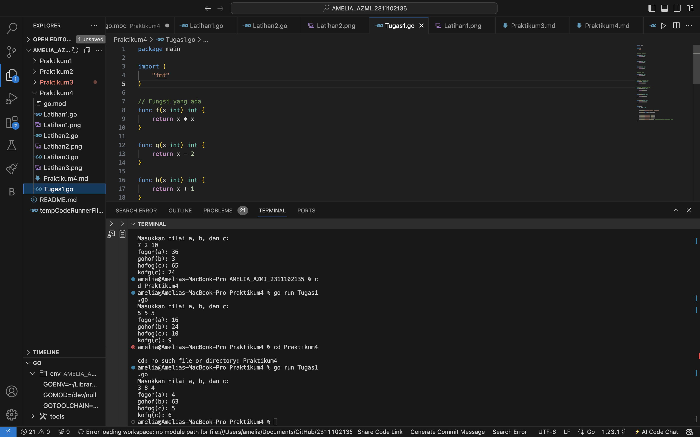
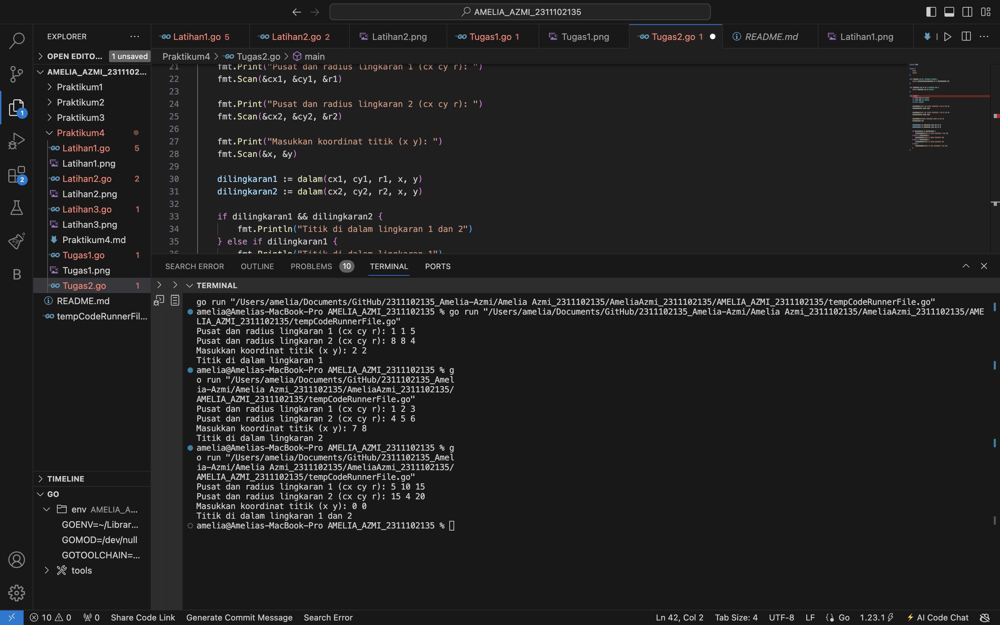
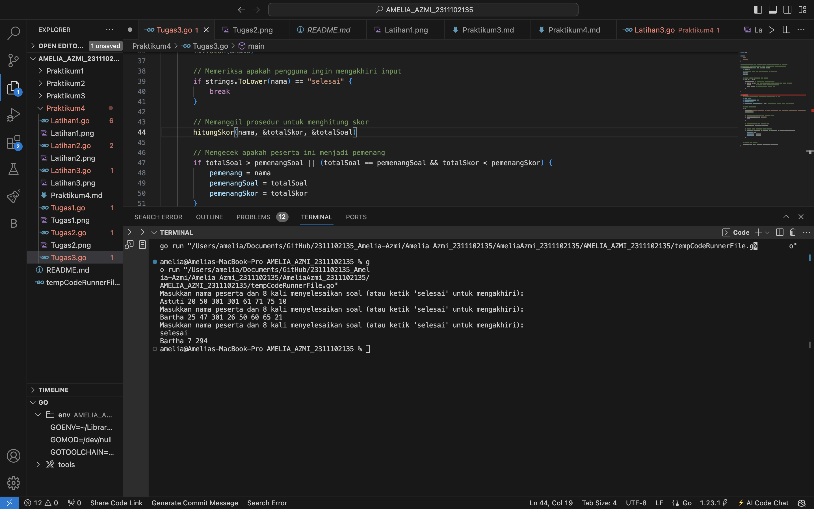

# <h1 align="center">Laporan Praktikum 4 "Fungsi" </h1>
<p align="center">Amelia Azmi - 2311102135</p>


# LATIHAN

## Latihan1

```go
package main

import "fmt"

func main() {
	var a, b int
	fmt.Scan(&a, &b)
	if a >= b {
		fmt.Println(permutasi(a, b))
	} else {
		fmt.Println(permutasi(b, a))
	}
}

func factorial(n int) int {
	var hasil int = 1
	var i int
	for i = 1; i <= n; i++ {
		hasil = hasil * i
	}
	return hasil
}
func permutasi(n, r int) int {
	return factorial(n) / factorial(n-r)
}
```

### Output:


## Latihan2

```go
package main

import (
	"fmt"
)

// Fungsi untuk menghitung faktorial
func factorial(n int) int {
	if n == 0 || n == 1 {
		return 1
	}
	result := 1
	for i := 2; i <= n; i++ {
		result *= 1
	}
	return result
}

// Fungsi untuk menghitung permutasi
func permutation(n, r int) int {
	return factorial(n) / factorial(n-r)
}

// Fungsi untuk menghitung kombinasi
func combination(n, r int) int {
	return factorial(n) / (factorial(r) * factorial(n-r))
}

func main() {
	var a, b, c, d int

	//Meminta input dari pengguna
	fmt.Println("Masukkan nilai a, b, c, d : ")
	fmt.Scan(&a, &b, &c, &d)

	//Menghitung permtasi dan kombinasi untuk a terhadap b
	p1 := permutation(a, c)
	c1 := combination(a, c)

	//Menghitung permutasi dan kombinasi untuk c terhadap d
	p2 := permutation(b, d)
	c2 := combination(b, d)

	//Output hasil
	fmt.Printf("P(%d,%d) = %d\n", a, c, p1)
	fmt.Printf("C(%d,%d) = %d\n", a, c, c1)
	fmt.Printf("P(%d,%d) = %d\n", b, d, p2)
	fmt.Printf("C(%d,%d) = %d\n", b, d, c2)
}

```

### Output:


## Latihan3

```go
package main

import (
	"fmt"
)

// Fungsi rekursif untuk menghitung deret fibonaci
func fibonaci(n int) int {
	if n == 0 {
		return 0
	} else if n == 1 {
		return 1
	} else {
		return fibonaci(n-1) + fibonaci(n-2)
	}
}

func main() {
	// Menampilkan deret fibonaci hingga suku ke-10
	fmt.Println("Deret fibonaci hingga suku ke-10 : ")
	for i := 0; i <= 10; i++ {
		fmt.Printf("Fibonaci(%d) = %d\n", i, fibonaci(i))
	}
}
```

### Output:


# TUGAS

## Tugas1

```go
package main

import (
	"fmt"
)

// Fungsi yang ada
func f(x int) int {
	return x * x
}

func g(x int) int {
	return x - 2
}

func h(x int) int {
	return x + 1
}

// Fungsi baru
func k(x int) int {
	return x * 3
}

// Fungsi komposisi baru
func kofg(c int) int {
	return k(g(c))
}

// Fungsi komposisi yang ada
func fogoh(a int) int {
	return f(g(h(a)))
}

func gohof(b int) int {
	return g(h(f(b)))
}

func hofog(c int) int {
	return h(f(g(c)))
}

func main() {
	var a, b, c int

	fmt.Println("Masukkan nilai a, b, dan c:")
	fmt.Scanf("%d %d %d", &a, &b, &c)

	fmt.Println("fogoh(a):", fogoh(a))
	fmt.Println("gohof(b):", gohof(b))
	fmt.Println("hofog(c):", hofog(c))
	fmt.Println("kofg(c):", kofg(c)) // Menampilkan hasil dari fungsi baru
}
```

### Output:



## Tugas2

```go
package main

import (
	"fmt"
	"math"
)

func jarak(a, b, c, d float64) float64 {
	return math.Sqrt(math.Pow(a-c, 2) + math.Pow(b-d, 2))
}

func dalam(cx, cy, r, x, y float64) bool {
	return jarak(cx, cy, x, y) <= r
}

func main() {
	var cx1, cy1, r1 float64
	var cx2, cy2, r2 float64
	var x, y float64

	fmt.Print("Pusat dan radius lingkaran 1 (cx cy r): ")
	fmt.Scan(&cx1, &cy1, &r1)

	fmt.Print("Pusat dan radius lingkaran 2 (cx cy r): ")
	fmt.Scan(&cx2, &cy2, &r2)

	fmt.Print("Masukkan koordinat titik (x y): ")
	fmt.Scan(&x, &y)

	dilingkaran1 := dalam(cx1, cy1, r1, x, y)
	dilingkaran2 := dalam(cx2, cy2, r2, x, y)

	if dilingkaran1 && dilingkaran2 {
		fmt.Println("Titik di dalam lingkaran 1 dan 2")
	} else if dilingkaran1 {
		fmt.Println("Titik di dalam lingkaran 1")
	} else if dilingkaran2 {
		fmt.Println("Titik di dalam lingkaran 2")
	} else {
		fmt.Println("Titik di luar lingkaran 1 dan 2")
	}
}
```

### Output:



## Tugas3

```go
package main

import (
	"fmt"
	"strings"
)

// Prosedur hitungSkor untuk menghitung total soal yang diselesaikan dan total skor
// Prosedur ini menggunakan parameter formal untuk mengambil input dari pengguna
func hitungSkor(nama string, skor *int, soal *int) {
	var waktu int
	// Inisialisasi jumlah soal yang diselesaikan dan total waktu
	*soal = 0
	*skor = 0

	// Membaca 8 waktu penyelesaian dari peserta
	for i := 0; i < 8; i++ {
		fmt.Scan(&waktu)  // Membaca waktu untuk setiap soal
		if waktu <= 300 { // Jika waktu penyelesaian kurang dari atau sama dengan 300 menit
			*soal++        // Menambah jumlah soal yang diselesaikan
			*skor += waktu // Menambahkan waktu ke total skor
		}
	}
}

func main() {
	// Deklarasi variabel untuk menyimpan nama peserta, skor, dan soal
	var nama string
	var totalSkor, totalSoal int
	var pemenang string
	var pemenangSkor, pemenangSoal int = 301, 0 // Inisialisasi pemenang dengan waktu maksimal

	// Meminta input peserta
	for {
		fmt.Println("Masukkan nama peserta dan 8 kali menyelesaikan soal (atau ketik 'selesai' untuk mengakhiri):")
		fmt.Scan(&nama)

		// Memeriksa apakah pengguna ingin mengakhiri input
		if strings.ToLower(nama) == "selesai" {
			break
		}

		// Memanggil prosedur untuk menghitung skor
		hitungSkor(nama, &totalSkor, &totalSoal)

		// Mengecek apakah peserta ini menjadi pemenang
		if totalSoal > pemenangSoal || (totalSoal == pemenangSoal && totalSkor < pemenangSkor) {
			pemenang = nama
			pemenangSoal = totalSoal
			pemenangSkor = totalSkor
		}
	}

	// Mencetak hasil pemenang
	fmt.Printf("%s %d %d\n", pemenang, pemenangSoal, pemenangSkor)
}
```

### Output:



## Tugas4

```go
package main

import (
	"fmt"
)

// Fungsi cetakDeret untuk mencetak deret sesuai aturan yang diberikan
func cetakDeret(n int) {
	for n != 1 {
		fmt.Print(n, " ")

		if n%2 == 0 {
			n = n / 2
		} else {
			n = 3*n + 1
		}
	}
	fmt.Println(1)
}

func main() {
	var n int

	// input dari pengguna
	fmt.Print("Masukkan nilai suku awal: ")
	fmt.Scanln(&n)

	// memastikan bahwa input valid (kurang dari 1 juta)
	if n <= 0 || n >= 1000000 {
		fmt.Println("Input harus bilangan positif dan kurang dari 1 juta!")
		return
	}
	cetakDeret(n)
}

```

### Output:


