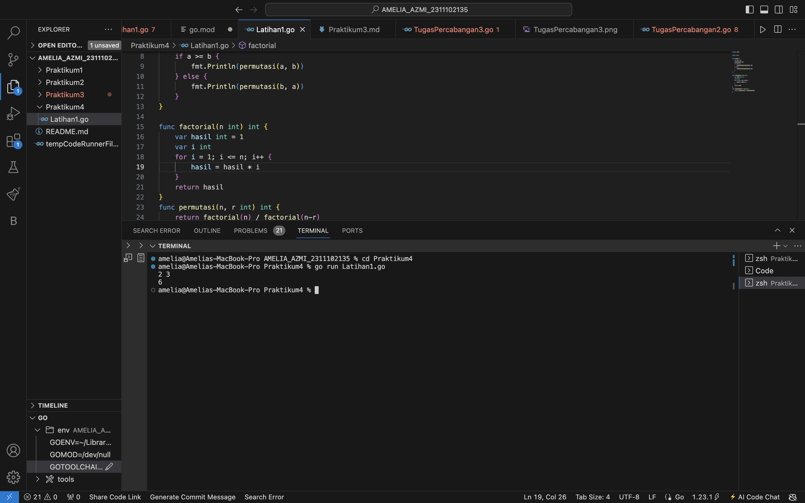
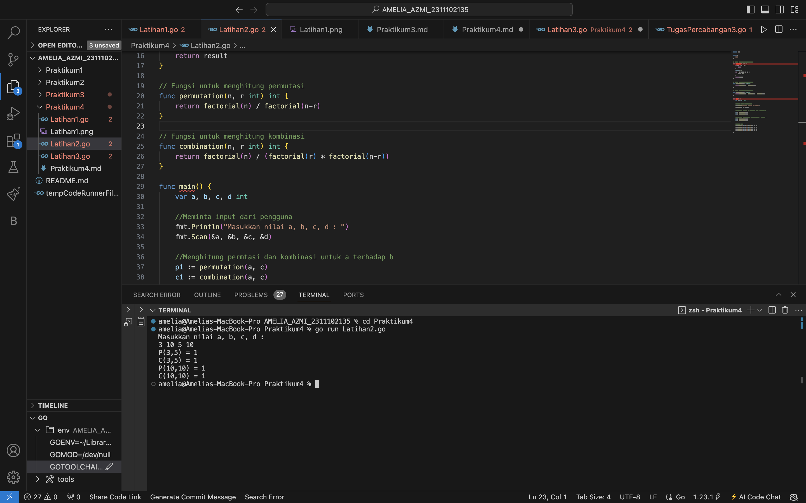
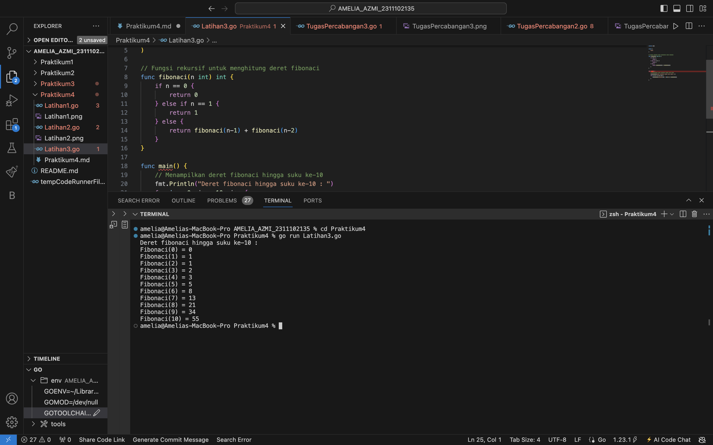

# <h1 align="center">Laporan Praktikum 4 "Fungsi" </h1>
<p align="center">Amelia Azmi - 2311102135</p>


# LATIHAN

## Latihan1

```go
package main

import "fmt"

func main() {
	var a, b int
	fmt.Scan(&a, &b)
	if a >= b {
		fmt.Println(permutasi(a, b))
	} else {
		fmt.Println(permutasi(b, a))
	}
}

func factorial(n int) int {
	var hasil int = 1
	var i int
	for i = 1; i <= n; i++ {
		hasil = hasil * i
	}
	return hasil
}
func permutasi(n, r int) int {
	return factorial(n) / factorial(n-r)
}
```

### Output:



## Latihan2

```go
package main

import (
	"fmt"
)

// Fungsi untuk menghitung faktorial
func factorial(n int) int {
	if n == 0 || n == 1 {
		return 1
	}
	result := 1
	for i := 2; i <= n; i++ {
		result *= 1
	}
	return result
}

// Fungsi untuk menghitung permutasi
func permutation(n, r int) int {
	return factorial(n) / factorial(n-r)
}

// Fungsi untuk menghitung kombinasi
func combination(n, r int) int {
	return factorial(n) / (factorial(r) * factorial(n-r))
}

func main() {
	var a, b, c, d int

	//Meminta input dari pengguna
	fmt.Println("Masukkan nilai a, b, c, d : ")
	fmt.Scan(&a, &b, &c, &d)

	//Menghitung permtasi dan kombinasi untuk a terhadap b
	p1 := permutation(a, c)
	c1 := combination(a, c)

	//Menghitung permutasi dan kombinasi untuk c terhadap d
	p2 := permutation(b, d)
	c2 := combination(b, d)

	//Output hasil
	fmt.Printf("P(%d,%d) = %d\n", a, c, p1)
	fmt.Printf("C(%d,%d) = %d\n", a, c, c1)
	fmt.Printf("P(%d,%d) = %d\n", b, d, p2)
	fmt.Printf("C(%d,%d) = %d\n", b, d, c2)
}

```

### Output:



## Latihan3

```go
package main

import (
	"fmt"
)

// Fungsi rekursif untuk menghitung deret fibonaci
func fibonaci(n int) int {
	if n == 0 {
		return 0
	} else if n == 1 {
		return 1
	} else {
		return fibonaci(n-1) + fibonaci(n-2)
	}
}

func main() {
	// Menampilkan deret fibonaci hingga suku ke-10
	fmt.Println("Deret fibonaci hingga suku ke-10 : ")
	for i := 0; i <= 10; i++ {
		fmt.Printf("Fibonaci(%d) = %d\n", i, fibonaci(i))
	}
}
```

### Output:




