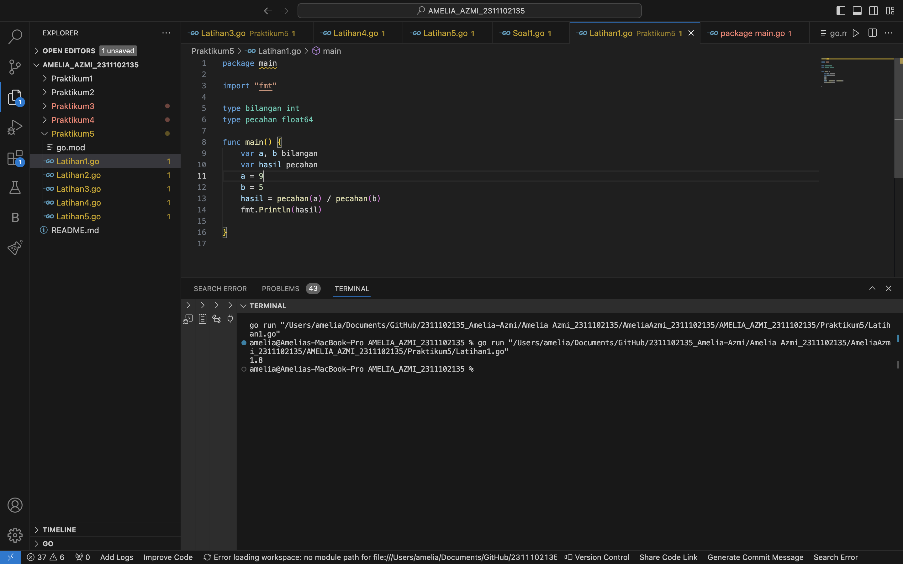
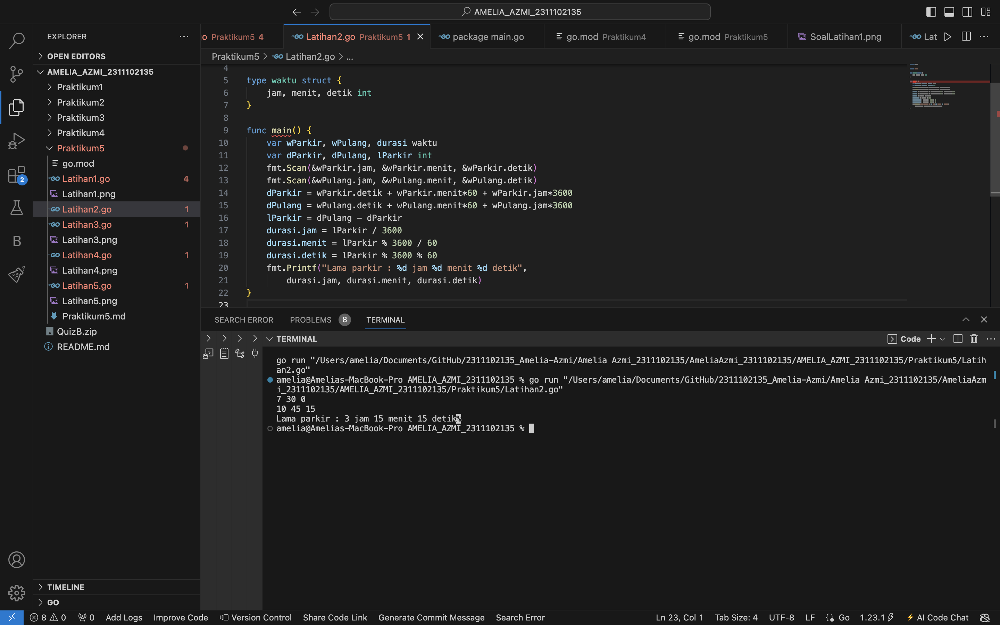
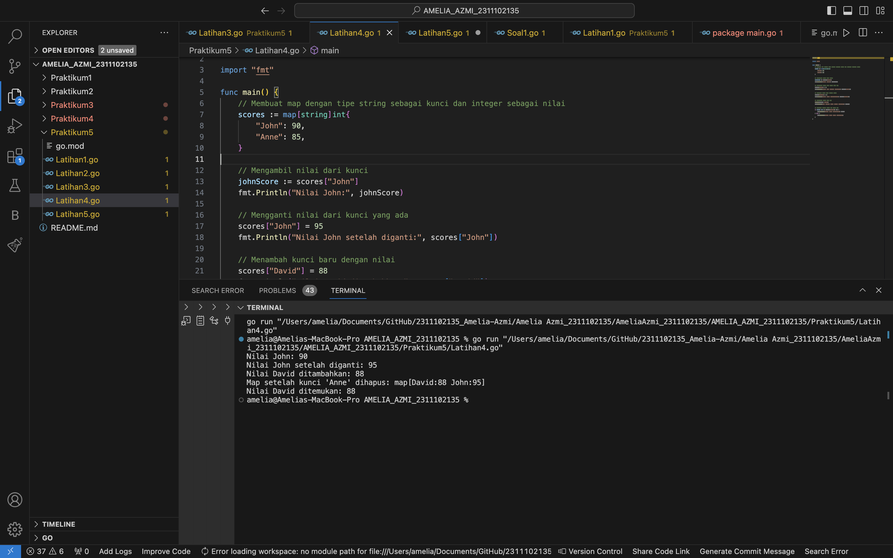
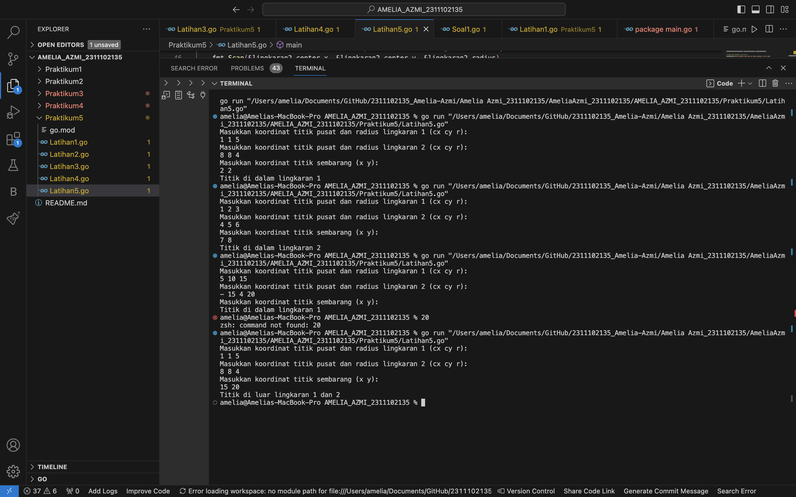
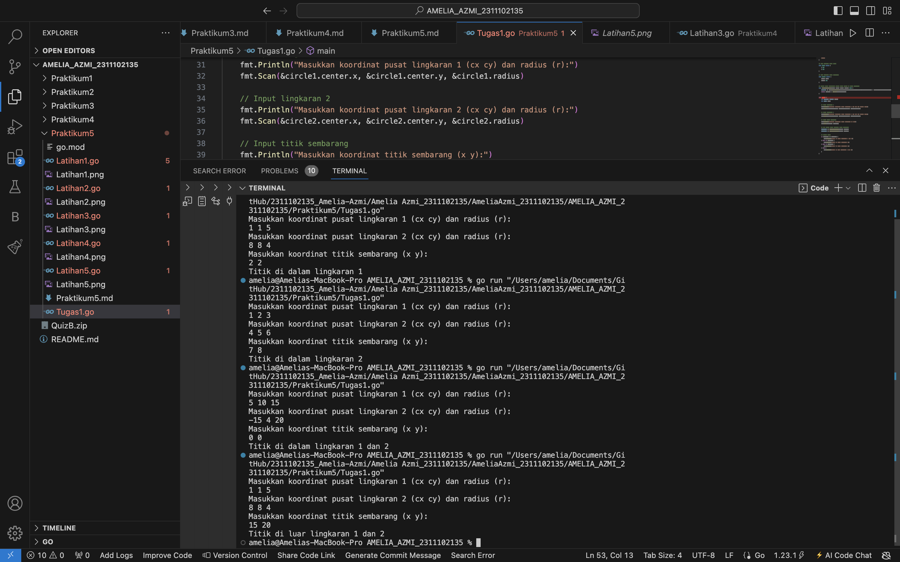
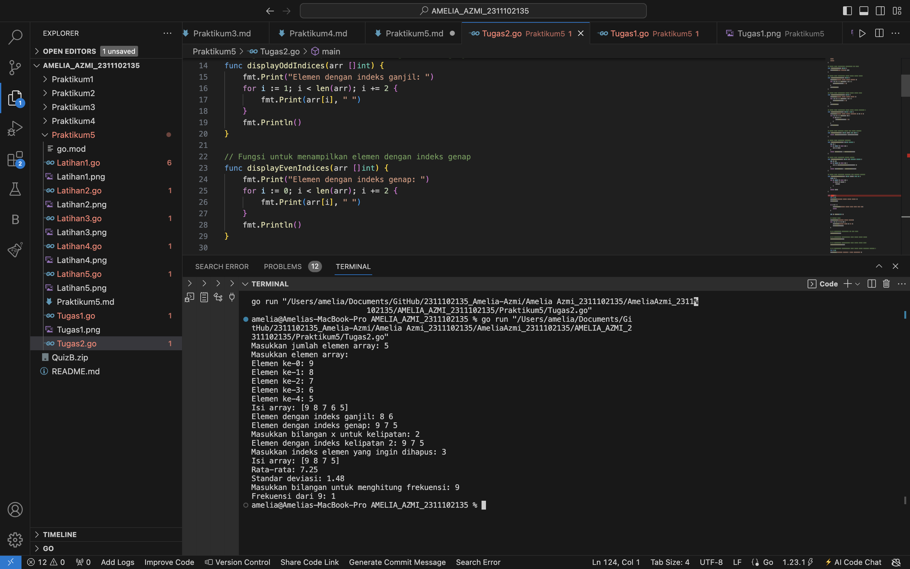
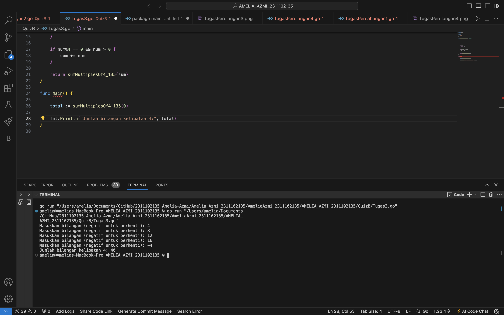
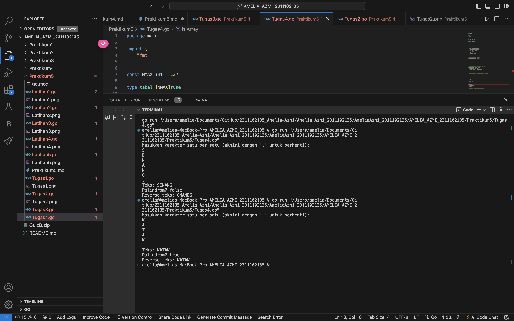

# <h1 align="center">Laporan Praktikum 5 "Struct dan Array" </h1>
<p align="center">Amelia Azmi - 2311102135</p>


# LATIHAN

## Latihan1

```go
package main

import "fmt"

type bilangan int
type pecahan float64

func main() {
	var a, b bilangan
	var hasil pecahan
	a = 9
	b = 5
	hasil = pecahan(a) / pecahan(b)
	fmt.Println(hasil)

}

```

### Output:



## Latihan2

```go
package main

import "fmt"

type waktu struct {
	jam, menit, detik int
}

func main() {
	var wParkir, wPulang, durasi waktu
	var dParkir, dPulang, lParkir int
	fmt.Scan(&wParkir.jam, &wParkir.menit, &wParkir.detik)
	fmt.Scan(&wPulang.jam, &wPulang.menit, &wPulang.detik)
	dParkir = wParkir.detik + wParkir.menit*60 + wParkir.jam*3600
	dPulang = wPulang.detik + wPulang.menit*60 + wPulang.jam*3600
	lParkir = dPulang - dParkir
	durasi.jam = lParkir / 3600
	durasi.menit = lParkir % 3600 / 60
	durasi.detik = lParkir % 3600 % 60
	fmt.Printf("Lama parkir : %d jam %d menit %d detik",
		durasi.jam, durasi.menit, durasi.detik)
}
```

### Output:



## Latihan3

```go
package main

import "fmt"

// Definisi tipe CircType
type CircType struct {
	Radius float64
}

// Definisi tipe NewType
type NewType struct {
	Name string
}

func main() {
	var (
		// Array arr mempunyai 73 elemen, masing-masing bertipe CircType
		arr [73]CircType

		// Array buf dengan 5 elemen, dengan nilai awal 7,3,5,2,11
		buf = [5]byte{7, 3, 5, 2, 11}

		// Array mhs berisi 2000 elemen NewType
		mhs [2000]NewType

		// Array dua dimensi rec berisi nilai float64
		rec [20][40]float64
	)

	// Mengisi beberapa elemen contoh
	arr[0] = CircType{Radius: 5.5}
	mhs[0] = NewType{Name: "Alice"}
	rec[0][0] = 3.14

	// Contoh penggunaan variabel
	fmt.Println("arr[0]:", arr[0])
	fmt.Println("buf:", buf)
	fmt.Println("mhs[0]:", mhs[0])
	fmt.Println("rec[0][0]:", rec[0][0])
}
```

### Output:


## Latihan4

```go
package main

import "fmt"

func main() {
	// Membuat map dengan tipe string sebagai kunci dan integer sebagai nilai
	scores := map[string]int{
		"John": 90,
		"Anne": 85,
	}

	// Mengambil nilai dari kunci
	johnScore := scores["John"]
	fmt.Println("Nilai John:", johnScore)

	// Mengganti nilai dari kunci yang ada
	scores["John"] = 95
	fmt.Println("Nilai John setelah diganti:", scores["John"])

	// Menambah kunci baru dengan nilai
	scores["David"] = 88
	fmt.Println("Nilai David ditambahkan:", scores["David"])

	// Menghapus kunci dari map
	delete(scores, "Anne")
	fmt.Println("Map setelah kunci 'Anne' dihapus:", scores)

	// Mengecek apakah kunci ada dalam map
	if score, ada := scores["David"]; ada {
		fmt.Println("Nilai David ditemukan:", score)
	} else {
		fmt.Println("Nilai David tidak ditemukan")
	}
}
```

### Output:



## Latihan5

```go
package main

import (
	"fmt"
	"math"
)

// Definisi tipe bentukan untuk titik
type Titik struct {
	x int
	y int
}

// Definisi tipe bentukan untuk lingkaran
type Lingkaran struct {
	center Titik
	radius int
}

// Fungsi untuk menghitung jarak antara dua titik
func jarak(p Titik, q Titik) float64 {
	return math.Sqrt(float64((p.x-q.x)*(p.x-q.x) + (p.y-q.y)*(p.y-q.y)))
}

// Fungsi untuk menentukan apakah titik berada di dalam lingkaran
func didalam(c Lingkaran, p Titik) bool {
	return jarak(p, c.center) < float64(c.radius)
}

func main() {
	var (
		// Mengambil input untuk lingkaran 1
		lingkaran1 Lingkaran
		// Mengambil input untuk lingkaran 2
		lingkaran2 Lingkaran
		// Mengambil input untuk titik sembarang
		point Titik
	)

	// Input untuk lingkaran 1 (cx, cy, r)
	fmt.Println("Masukkan koordinat titik pusat dan radius lingkaran 1 (cx cy r):")
	fmt.Scan(&lingkaran1.center.x, &lingkaran1.center.y, &lingkaran1.radius)

	// Input untuk lingkaran 2 (cx, cy, r)
	fmt.Println("Masukkan koordinat titik pusat dan radius lingkaran 2 (cx cy r):")
	fmt.Scan(&lingkaran2.center.x, &lingkaran2.center.y, &lingkaran2.radius)

	// Input untuk titik sembarang (x, y)
	fmt.Println("Masukkan koordinat titik sembarang (x y):")
	fmt.Scan(&point.x, &point.y)

	// Mengecek posisi titik terhadap kedua lingkaran
	inLingkaran1 := didalam(lingkaran1, point)
	inLingkaran2 := didalam(lingkaran2, point)

	if inLingkaran1 && inLingkaran2 {
		fmt.Println("Titik di dalam lingkaran 1 dan 2")
	} else if inLingkaran1 {
		fmt.Println("Titik di dalam lingkaran 1")
	} else if inLingkaran2 {
		fmt.Println("Titik di dalam lingkaran 2")
	} else {
		fmt.Println("Titik di luar lingkaran 1 dan 2")
	}
}
```

### Output:



# TUGAS

## Tugas1

```go
package main

import (
	"fmt"
	"math"
)

// Tipe bentukan untuk titik
type Point struct {
	x int
	y int
}

// Tipe bentukan untuk lingkaran
type Circle struct {
	center Point
	radius int
}

// Fungsi untuk menentukan apakah titik berada di dalam lingkaran
func isPointInCircle(point Point, circle Circle) bool {
	distance := math.Sqrt(float64((point.x-circle.center.x)*(point.x-circle.center.x) + (point.y-circle.center.y)*(point.y-circle.center.y)))
	return distance < float64(circle.radius)
}

func main() {
	var circle1, circle2 Circle
	var point Point

	// Input lingkaran 1
	fmt.Println("Masukkan koordinat pusat lingkaran 1 (cx cy) dan radius (r):")
	fmt.Scan(&circle1.center.x, &circle1.center.y, &circle1.radius)

	// Input lingkaran 2
	fmt.Println("Masukkan koordinat pusat lingkaran 2 (cx cy) dan radius (r):")
	fmt.Scan(&circle2.center.x, &circle2.center.y, &circle2.radius)

	// Input titik sembarang
	fmt.Println("Masukkan koordinat titik sembarang (x y):")
	fmt.Scan(&point.x, &point.y)

	// Cek posisi titik terhadap kedua lingkaran
	inCircle1 := isPointInCircle(point, circle1)
	inCircle2 := isPointInCircle(point, circle2)

	// Output hasil
	if inCircle1 && inCircle2 {
		fmt.Println("Titik di dalam lingkaran 1 dan 2")
	} else if inCircle1 {
		fmt.Println("Titik di dalam lingkaran 1")
	} else if inCircle2 {
		fmt.Println("Titik di dalam lingkaran 2")
	} else {
		fmt.Println("Titik di luar lingkaran 1 dan 2")
	}
}
```

### Output:



## Tugas2

```go
package main

import (
	"fmt"
	"math"
)

// Fungsi untuk menampilkan keseluruhan isi array
func displayArray(arr []int) {
	fmt.Println("Isi array:", arr)
}

// Fungsi untuk menampilkan elemen dengan indeks ganjil
func displayOddIndices(arr []int) {
	fmt.Print("Elemen dengan indeks ganjil: ")
	for i := 1; i < len(arr); i += 2 {
		fmt.Print(arr[i], " ")
	}
	fmt.Println()
}

// Fungsi untuk menampilkan elemen dengan indeks genap
func displayEvenIndices(arr []int) {
	fmt.Print("Elemen dengan indeks genap: ")
	for i := 0; i < len(arr); i += 2 {
		fmt.Print(arr[i], " ")
	}
	fmt.Println()
}

// Fungsi untuk menampilkan elemen dengan indeks kelipatan x
func displayMultiples(arr []int, x int) {
	fmt.Print("Elemen dengan indeks kelipatan ", x, ": ")
	for i := 0; i < len(arr); i++ {
		if i%x == 0 {
			fmt.Print(arr[i], " ")
		}
	}
	fmt.Println()
}

// Fungsi untuk menghapus elemen pada indeks tertentu
func deleteElement(arr []int, index int) []int {
	return append(arr[:index], arr[index+1:]...)
}

// Fungsi untuk menghitung rata-rata
func calculateAverage(arr []int) float64 {
	sum := 0
	for _, value := range arr {
		sum += value
	}
	return float64(sum) / float64(len(arr))
}

// Fungsi untuk menghitung standar deviasi
func calculateStdDev(arr []int, avg float64) float64 {
	sum := 0.0
	for _, value := range arr {
		sum += math.Pow(float64(value)-avg, 2)
	}
	return math.Sqrt(sum / float64(len(arr)))
}

// Fungsi untuk menghitung frekuensi dari bilangan tertentu
func calculateFrequency(arr []int, target int) int {
	count := 0
	for _, value := range arr {
		if value == target {
			count++
		}
	}
	return count
}

func main() {
	var N int
	fmt.Print("Masukkan jumlah elemen array: ")
	fmt.Scan(&N)

	if N <= 0 {
		fmt.Println("Jumlah elemen harus lebih dari 0.")
		return
	}

	arr := make([]int, N)

	// Mengisi array
	fmt.Println("Masukkan elemen array:")
	for i := 0; i < N; i++ {
		fmt.Print("Elemen ke-", i, ": ")
		fmt.Scan(&arr[i])
	}

	// a. Menampilkan keseluruhan isi dari array
	displayArray(arr)

	// b. Menampilkan elemen-elemen array dengan indeks ganjil
	displayOddIndices(arr)

	// c. Menampilkan elemen-elemen array dengan indeks genap
	displayEvenIndices(arr)

	// d. Menampilkan elemen-elemen array dengan indeks kelipatan bilangan x
	var x int
	fmt.Print("Masukkan bilangan x untuk kelipatan: ")
	fmt.Scan(&x)
	displayMultiples(arr, x)

	// e. Menghapus elemen array pada indeks tertentu
	var deleteIndex int
	fmt.Print("Masukkan indeks elemen yang ingin dihapus: ")
	fmt.Scan(&deleteIndex)
	if deleteIndex >= 0 && deleteIndex < len(arr) {
		arr = deleteElement(arr, deleteIndex)
		displayArray(arr)
	} else {
		fmt.Println("Indeks tidak valid.")
	}

	// f. Menampilkan rata-rata dari bilangan yang ada di dalam array
	average := calculateAverage(arr)
	fmt.Printf("Rata-rata: %.2f\n", average)

	// g. Menampilkan standar deviasi dari bilangan yang ada di dalam array
	stdDev := calculateStdDev(arr, average)
	fmt.Printf("Standar deviasi: %.2f\n", stdDev)

	// h. Menampilkan frekuensi dari suatu bilangan tertentu di dalam array
	var target int
	fmt.Print("Masukkan bilangan untuk menghitung frekuensi: ")
	fmt.Scan(&target)
	frequency := calculateFrequency(arr, target)
	fmt.Printf("Frekuensi dari %d: %d\n", target, frequency)
}
```

### Output:



## Tugas3

```go
package main

import (
	"fmt"
)

func main() {
	// Meminta input nama klub yang bertanding
	var klubA, klubB string
	fmt.Print("Masukkan nama Klub A: ")
	fmt.Scanln(&klubA)
	fmt.Print("Masukkan nama Klub B: ")
	fmt.Scanln(&klubB)

	// Array untuk menyimpan hasil pemenang setiap pertandingan
	var hasilPertandingan []string

	// Variabel untuk menyimpan skor
	var skorA, skorB int
	pertandingan := 1

	// Loop untuk memasukkan skor setiap pertandingan
	for {
		// Menerima input skor dengan format "skorA skorB" dalam satu baris
		fmt.Printf("Pertandingan %d - Masukkan skor (%s %s): ", pertandingan, klubA, klubB)
		_, err := fmt.Scanln(&skorA, &skorB)
		if err != nil {
			fmt.Println("Input tidak valid, program dihentikan.")
			break
		}

		// Cek apakah skor valid (tidak negatif)
		if skorA < 0 || skorB < 0 {
			fmt.Println("Skor tidak valid, program dihentikan.")
			break
		}

		// Menentukan pemenang dan menyimpan hasilnya ke array hasilPertandingan
		if skorA > skorB {
			hasilPertandingan = append(hasilPertandingan, fmt.Sprintf("Hasil %d: %s", pertandingan, klubA))
		} else if skorB > skorA {
			hasilPertandingan = append(hasilPertandingan, fmt.Sprintf("Hasil %d: %s", pertandingan, klubB))
		} else {
			hasilPertandingan = append(hasilPertandingan, fmt.Sprintf("Hasil %d: Draw", pertandingan))
		}

		// Naikkan nomor pertandingan
		pertandingan++
	}

	// Menampilkan daftar hasil pertandingan setelah input selesai
	fmt.Println("Daftar hasil pertandingan:")
	for _, hasil := range hasilPertandingan {
		fmt.Println(hasil)
	}
	fmt.Println("Pertandingan selesai")
}
```

### Output:



## Tugas4

```go
package main

import (
	"fmt"
)

const NMAX int = 127

type tabel [NMAX]rune

// Fungsi untuk mengisi array hingga karakter TITIK atau jumlah maksimum elemen tercapai
func isiArray(t *tabel, n *int) {
	var input rune
	fmt.Println("Masukkan karakter satu per satu (akhiri dengan '.' untuk berhenti):")
	for *n = 0; *n < NMAX; *n++ {
		fmt.Scanf("%c\n", &input)
		if input == '.' {
			break
		}
		(*t)[*n] = input
	}
}

// Fungsi untuk mencetak isi array
func cetakArray(t tabel, n int) {
	for i := 0; i < n; i++ {
		fmt.Printf("%c", t[i])
	}
	fmt.Println()
}

// Fungsi untuk membalik urutan elemen dalam array
func balikanArray(t *tabel, n int) {
	for i := 0; i < n/2; i++ {
		t[i], t[n-1-i] = t[n-1-i], t[i]
	}
}

// Fungsi untuk mengecek apakah array membentuk palindrom
func palindrom(t tabel, n int) bool {
	for i := 0; i < n/2; i++ {
		if t[i] != t[n-1-i] {
			return false
		}
	}
	return true
}

func main() {
	var tab tabel
	var m int

	// Memanggil prosedur untuk mengisi array
	isiArray(&tab, &m)

	// Cetak array awal
	fmt.Print("Teks: ")
	cetakArray(tab, m)

	// Memeriksa apakah array membentuk palindrom
	isPalindrome := palindrom(tab, m)
	fmt.Printf("Palindrom? %v\n", isPalindrome)

	// Balikkan array dan cetak
	balikanArray(&tab, m)
	fmt.Print("Reverse teks: ")
	cetakArray(tab, m)
}
```

### Output:


