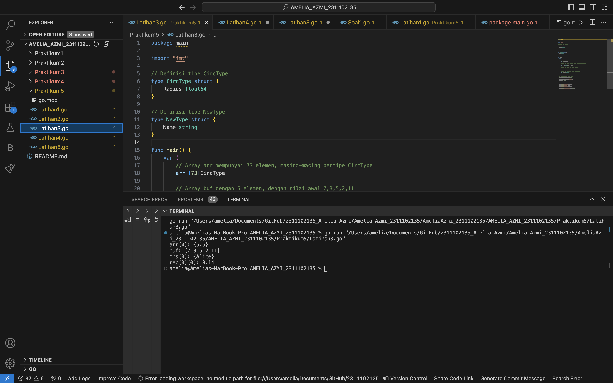

# <h1 align="center">Laporan Praktikum 5 "Struct dan Array" </h1>
<p align="center">Amelia Azmi - 2311102135</p>


# LATIHAN

## Latihan1

```go
package main

import "fmt"

type bilangan int
type pecahan float64

func main() {
	var a, b bilangan
	var hasil pecahan
	a = 9
	b = 5
	hasil = pecahan(a) / pecahan(b)
	fmt.Println(hasil)

}

```

### Output:


## Latihan2

```go
package main

import "fmt"
type waktu struct {
	jam, menit, detik int
}

func main(){
	var wParkir, wPulang durasi waktu
	var dParkir, dPulang, IParkir int
	fmt.Scan (&wParkir.jam, &wParkir.menit, &wParkir.detik)
	fmt.Scan (&wPulang.jam, &wPulang.menit, &wPulang.detik)
	dParkir = wParkir.detik + wParkir.menit*60 + wParkir.jam*3600
	dPulang = wPulang.detik + wPulang.menit*60 + wPulang.jam*3600
	IParkir = dPulang - dParkir
	durasi.jam = IParkir / 3600
	durasi.menit = IParkir % 3600 / 60
	durasi.detik = IParkir % 3600 % 60
	fmt.Print("Lama parkir: %d jam %d menit %d detik", durasi.jam, durasi.menit, durasi.detik)


}
```

### Output:


## Latihan3

```go
package main

import "fmt"

// Definisi tipe CircType
type CircType struct {
	Radius float64
}

// Definisi tipe NewType
type NewType struct {
	Name string
}

func main() {
	var (
		// Array arr mempunyai 73 elemen, masing-masing bertipe CircType
		arr [73]CircType

		// Array buf dengan 5 elemen, dengan nilai awal 7,3,5,2,11
		buf = [5]byte{7, 3, 5, 2, 11}

		// Array mhs berisi 2000 elemen NewType
		mhs [2000]NewType

		// Array dua dimensi rec berisi nilai float64
		rec [20][40]float64
	)

	// Mengisi beberapa elemen contoh
	arr[0] = CircType{Radius: 5.5}
	mhs[0] = NewType{Name: "Alice"}
	rec[0][0] = 3.14

	// Contoh penggunaan variabel
	fmt.Println("arr[0]:", arr[0])
	fmt.Println("buf:", buf)
	fmt.Println("mhs[0]:", mhs[0])
	fmt.Println("rec[0][0]:", rec[0][0])
}
```

### Output:



## Latihan4

```go
package main

import "fmt"

func main() {
	// Membuat map dengan tipe string sebagai kunci dan integer sebagai nilai
	scores := map[string]int{
		"John": 90,
		"Anne": 85,
	}

	// Mengambil nilai dari kunci
	johnScore := scores["John"]
	fmt.Println("Nilai John:", johnScore)

	// Mengganti nilai dari kunci yang ada
	scores["John"] = 95
	fmt.Println("Nilai John setelah diganti:", scores["John"])

	// Menambah kunci baru dengan nilai
	scores["David"] = 88
	fmt.Println("Nilai David ditambahkan:", scores["David"])

	// Menghapus kunci dari map
	delete(scores, "Anne")
	fmt.Println("Map setelah kunci 'Anne' dihapus:", scores)

	// Mengecek apakah kunci ada dalam map
	if score, ada := scores["David"]; ada {
		fmt.Println("Nilai David ditemukan:", score)
	} else {
		fmt.Println("Nilai David tidak ditemukan")
	}
}
```

### Output:


## Latihan5

```go
package main

import (
	"fmt"
	"math"
)

// Definisi tipe bentukan untuk titik
type Titik struct {
	x int
	y int
}

// Definisi tipe bentukan untuk lingkaran
type Lingkaran struct {
	center Titik
	radius int
}

// Fungsi untuk menghitung jarak antara dua titik
func jarak(p Titik, q Titik) float64 {
	return math.Sqrt(float64((p.x-q.x)*(p.x-q.x) + (p.y-q.y)*(p.y-q.y)))
}

// Fungsi untuk menentukan apakah titik berada di dalam lingkaran
func didalam(c Lingkaran, p Titik) bool {
	return jarak(p, c.center) < float64(c.radius)
}

func main() {
	var (
		// Mengambil input untuk lingkaran 1
		lingkaran1 Lingkaran
		// Mengambil input untuk lingkaran 2
		lingkaran2 Lingkaran
		// Mengambil input untuk titik sembarang
		point Titik
	)

	// Input untuk lingkaran 1 (cx, cy, r)
	fmt.Println("Masukkan koordinat titik pusat dan radius lingkaran 1 (cx cy r):")
	fmt.Scan(&lingkaran1.center.x, &lingkaran1.center.y, &lingkaran1.radius)

	// Input untuk lingkaran 2 (cx, cy, r)
	fmt.Println("Masukkan koordinat titik pusat dan radius lingkaran 2 (cx cy r):")
	fmt.Scan(&lingkaran2.center.x, &lingkaran2.center.y, &lingkaran2.radius)

	// Input untuk titik sembarang (x, y)
	fmt.Println("Masukkan koordinat titik sembarang (x y):")
	fmt.Scan(&point.x, &point.y)

	// Mengecek posisi titik terhadap kedua lingkaran
	inLingkaran1 := didalam(lingkaran1, point)
	inLingkaran2 := didalam(lingkaran2, point)

	if inLingkaran1 && inLingkaran2 {
		fmt.Println("Titik di dalam lingkaran 1 dan 2")
	} else if inLingkaran1 {
		fmt.Println("Titik di dalam lingkaran 1")
	} else if inLingkaran2 {
		fmt.Println("Titik di dalam lingkaran 2")
	} else {
		fmt.Println("Titik di luar lingkaran 1 dan 2")
	}
}
```

### Output:


