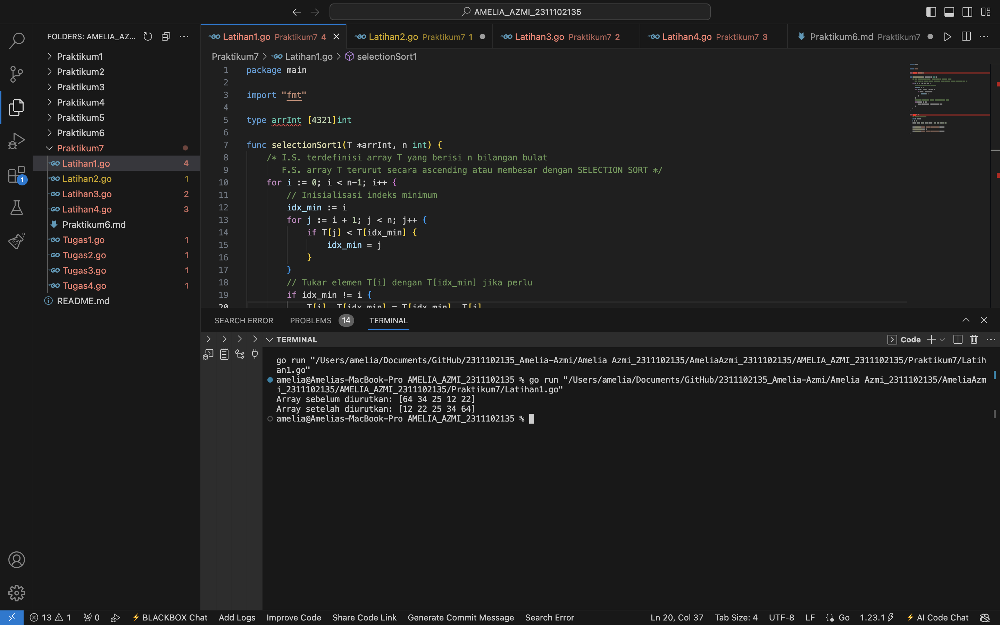
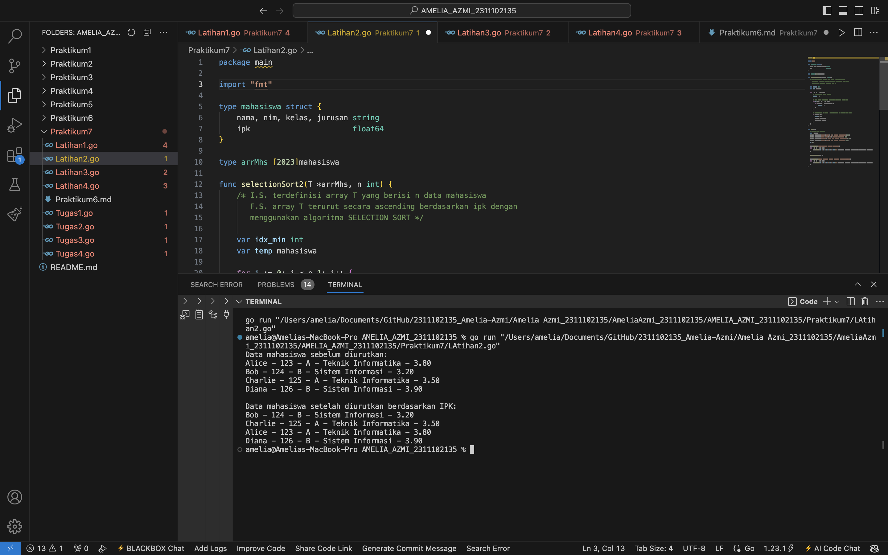
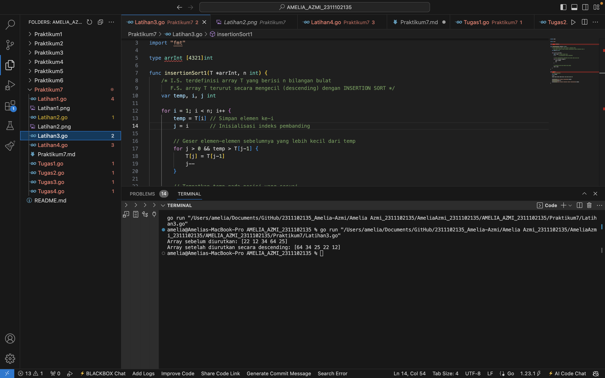
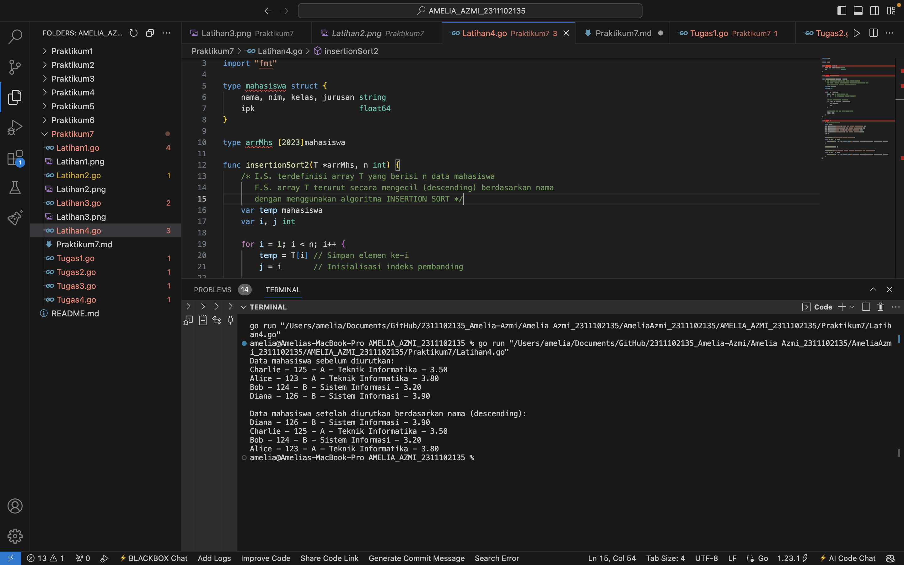
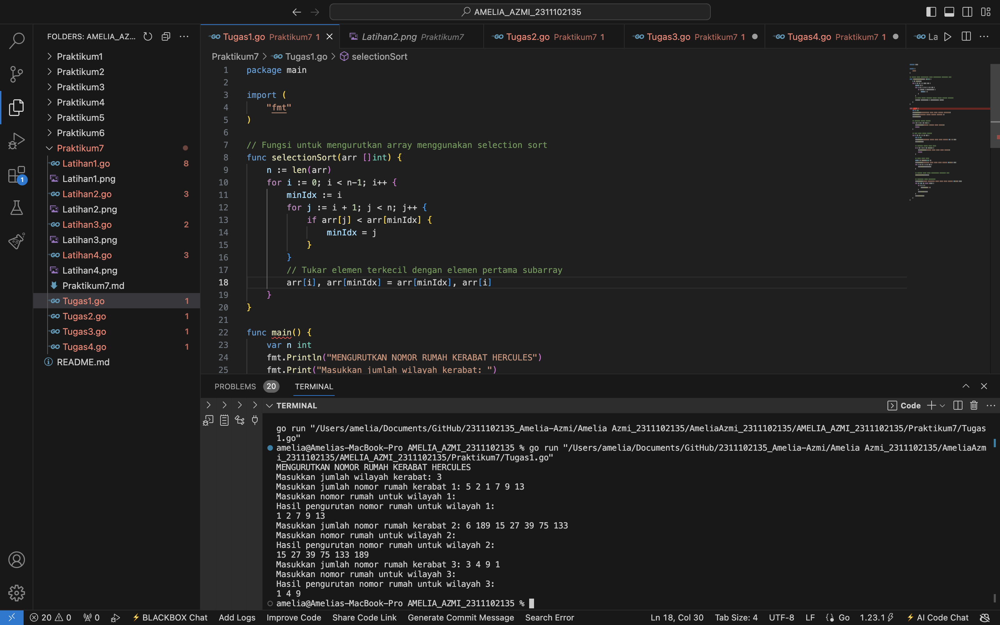
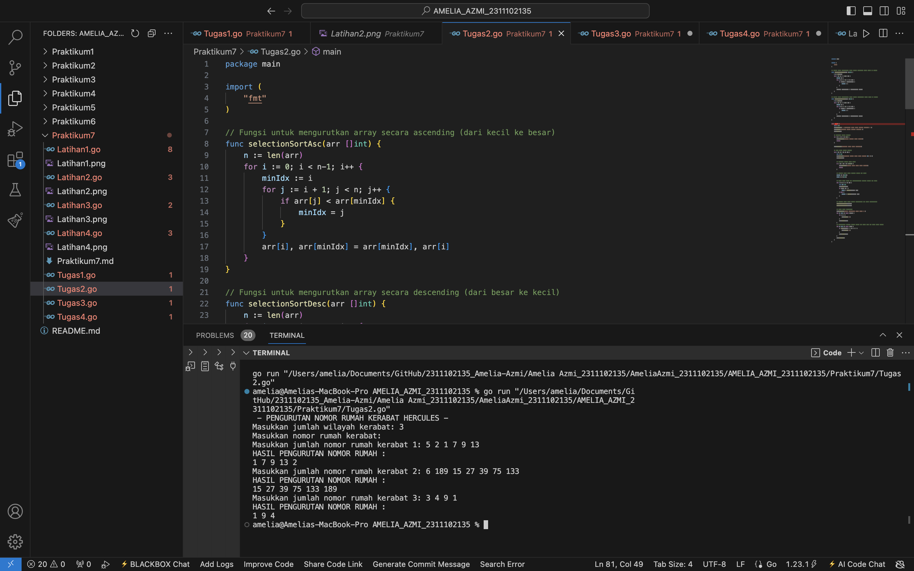
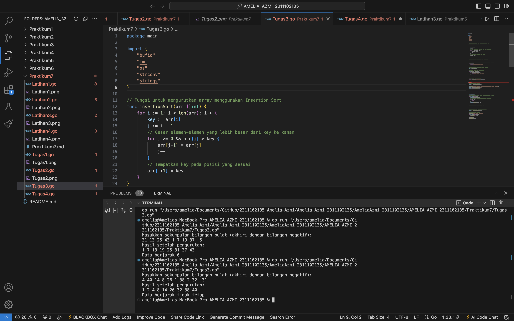
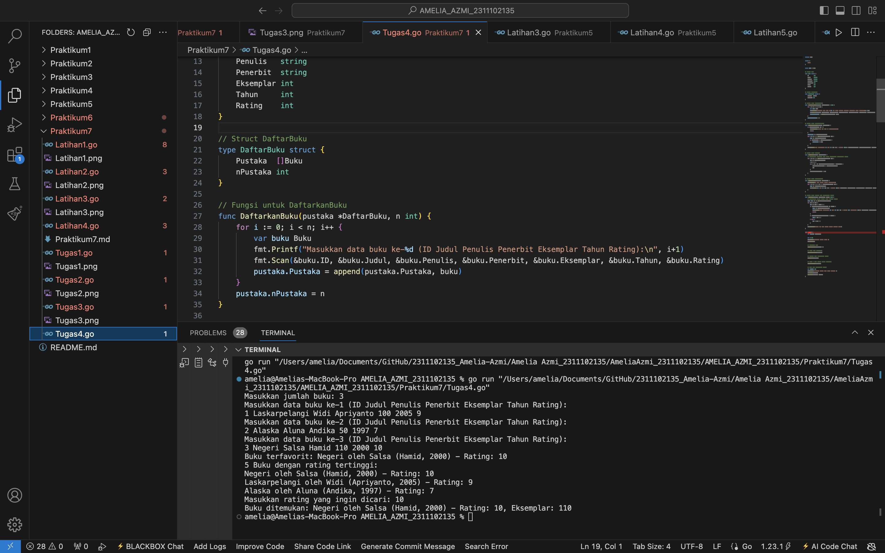

# <h1 align="center">Laporan Praktikum 7 "PENGURUTAN DATA" </h1>
<p align="center">Amelia Azmi - 2311102135</p>


# LATIHAN

## Latihan1

```go
package main

import "fmt"

type arrInt [4321]int

func selectionSort1(T *arrInt, n int) {
	/* I.S. terdefinisi array T yang berisi n bilangan bulat
	   F.S. array T terurut secara ascending atau membesar dengan SELECTION SORT */
	for i := 0; i < n-1; i++ {
		// Inisialisasi indeks minimum
		idx_min := i
		for j := i + 1; j < n; j++ {
			if T[j] < T[idx_min] {
				idx_min = j
			}
		}
		// Tukar elemen T[i] dengan T[idx_min] jika perlu
		if idx_min != i {
			T[i], T[idx_min] = T[idx_min], T[i]
		}
	}
}

func main() {
	// Contoh penggunaan
	var T arrInt
	n := 5
	T[0], T[1], T[2], T[3], T[4] = 64, 34, 25, 12, 22

	fmt.Println("Array sebelum diurutkan:", T[:n])
	selectionSort1(&T, n)
	fmt.Println("Array setelah diurutkan:", T[:n])
}
```

### Output:



## Latihan2

```go
package main

import "fmt"

type mahasiswa struct {
	nama, nim, kelas, jurusan string
	ipk                       float64
}

type arrMhs [2023]mahasiswa

func selectionSort2(T *arrMhs, n int) {
	/* I.S. terdefinisi array T yang berisi n data mahasiswa
	   F.S. array T terurut secara ascending berdasarkan ipk dengan
	   menggunakan algoritma SELECTION SORT */

	var idx_min int
	var temp mahasiswa

	for i := 0; i < n-1; i++ {
		// Inisialisasi indeks minimum
		idx_min = i

		// Cari elemen dengan IPK terkecil di subarray [i+1, n-1]
		for j := i + 1; j < n; j++ {
			if T[j].ipk < T[idx_min].ipk {
				idx_min = j
			}
		}

		// Tukar elemen di indeks i dengan elemen di idx_min jika perlu
		if idx_min != i {
			temp = T[i]
			T[i] = T[idx_min]
			T[idx_min] = temp
		}
	}
}

func main() {
	// Contoh data mahasiswa
	var T arrMhs
	T[0] = mahasiswa{"Alice", "123", "A", "Teknik Informatika", 3.8}
	T[1] = mahasiswa{"Bob", "124", "B", "Sistem Informasi", 3.2}
	T[2] = mahasiswa{"Charlie", "125", "A", "Teknik Informatika", 3.5}
	T[3] = mahasiswa{"Diana", "126", "B", "Sistem Informasi", 3.9}
	n := 4

	fmt.Println("Data mahasiswa sebelum diurutkan:")
	for i := 0; i < n; i++ {
		fmt.Printf("%s - %s - %s - %s - %.2f\n", T[i].nama, T[i].nim, T[i].kelas, T[i].jurusan, T[i].ipk)
	}

	selectionSort2(&T, n)

	fmt.Println("\nData mahasiswa setelah diurutkan berdasarkan IPK:")
	for i := 0; i < n; i++ {
		fmt.Printf("%s - %s - %s - %s - %.2f\n", T[i].nama, T[i].nim, T[i].kelas, T[i].jurusan, T[i].ipk)
	}
}
```

### Output:



## Latihan3

```go
package main

import "fmt"

type arrInt [4321]int

func insertionSort1(T *arrInt, n int) {
	/* I.S. terdefinisi array T yang berisi n bilangan bulat
	   F.S. array T terurut secara mengecil (descending) dengan INSERTION SORT */
	var temp, i, j int

	for i = 1; i < n; i++ {
		temp = T[i] // Simpan elemen ke-i
		j = i       // Inisialisasi indeks pembanding

		// Geser elemen-elemen sebelumnya yang lebih kecil dari temp
		for j > 0 && temp > T[j-1] {
			T[j] = T[j-1]
			j--
		}

		// Tempatkan temp pada posisi yang sesuai
		T[j] = temp
	}
}

func main() {
	// Contoh penggunaan
	var T arrInt
	n := 5
	T[0], T[1], T[2], T[3], T[4] = 22, 12, 34, 64, 25

	fmt.Println("Array sebelum diurutkan:", T[:n])
	insertionSort1(&T, n)
	fmt.Println("Array setelah diurutkan secara descending:", T[:n])
}

```

### Output:



## Latihan4

```go
package main

import "fmt"

type mahasiswa struct {
	nama, nim, kelas, jurusan string
	ipk                       float64
}

type arrMhs [2023]mahasiswa

func insertionSort2(T *arrMhs, n int) {
	/* I.S. terdefinisi array T yang berisi n data mahasiswa
	   F.S. array T terurut secara mengecil (descending) berdasarkan nama
	   dengan menggunakan algoritma INSERTION SORT */
	var temp mahasiswa
	var i, j int

	for i = 1; i < n; i++ {
		temp = T[i] // Simpan elemen ke-i
		j = i       // Inisialisasi indeks pembanding

		// Geser elemen-elemen sebelumnya
		for j > 0 && temp.nama > T[j-1].nama {
			T[j] = T[j-1]
			j--
		}

		// Tempatkan temp pada posisi yang sesuai
		T[j] = temp
	}
}

func main() {
	// Contoh data mahasiswa
	var T arrMhs
	T[0] = mahasiswa{"Charlie", "125", "A", "Teknik Informatika", 3.5}
	T[1] = mahasiswa{"Alice", "123", "A", "Teknik Informatika", 3.8}
	T[2] = mahasiswa{"Bob", "124", "B", "Sistem Informasi", 3.2}
	T[3] = mahasiswa{"Diana", "126", "B", "Sistem Informasi", 3.9}
	n := 4

	fmt.Println("Data mahasiswa sebelum diurutkan:")
	for i := 0; i < n; i++ {
		fmt.Printf("%s - %s - %s - %s - %.2f\n", T[i].nama, T[i].nim, T[i].kelas, T[i].jurusan, T[i].ipk)
	}

	insertionSort2(&T, n)

	fmt.Println("\nData mahasiswa setelah diurutkan berdasarkan nama (descending):")
	for i := 0; i < n; i++ {
		fmt.Printf("%s - %s - %s - %s - %.2f\n", T[i].nama, T[i].nim, T[i].kelas, T[i].jurusan, T[i].ipk)
	}
}
```
### Output:



# TUGAS

## Tugas1

```go
package main

import (
	"fmt"
)

// Fungsi untuk mengurutkan array menggunakan selection sort
func selectionSort(arr []int) {
	n := len(arr)
	for i := 0; i < n-1; i++ {
		minIdx := i
		for j := i + 1; j < n; j++ {
			if arr[j] < arr[minIdx] {
				minIdx = j
			}
		}
		// Tukar elemen terkecil dengan elemen pertama subarray
		arr[i], arr[minIdx] = arr[minIdx], arr[i]
	}
}

func main() {
	var n int
	fmt.Println("MENGURUTKAN NOMOR RUMAH KERABAT HERCULES")
	fmt.Print("Masukkan jumlah wilayah kerabat: ")
	fmt.Scan(&n)

	// Validasi jumlah wilayah
	if n <= 0 || n >= 1000 {
		fmt.Println("Jumlah wilayah tidak valid!")
		return
	}

	// Loop untuk setiap wilayah
	for i := 0; i < n; i++ {
		var m int
		fmt.Printf("Masukkan jumlah nomor rumah kerabat %d: ", i+1)
		fmt.Scan(&m)

		// Validasi jumlah nomor rumah
		if m <= 0 || m >= 1000000 {
			fmt.Println("Jumlah nomor rumah tidak valid!")
			return
		}

		// Input nomor rumah
		rumah := make([]int, m)
		fmt.Printf("Masukkan nomor rumah untuk wilayah %d:\n", i+1)
		for j := 0; j < m; j++ {
			fmt.Scan(&rumah[j])
		}

		// Urutkan nomor rumah menggunakan selection sort
		selectionSort(rumah)

		// Tampilkan hasil pengurutan
		fmt.Printf("Hasil pengurutan nomor rumah untuk wilayah %d:\n", i+1)
		for j, num := range rumah {
			if j > 0 {
				fmt.Print(" ")
			}
			fmt.Print(num)
		}
		fmt.Println()
	}
}
```

### Output:



## Tugas2

```go
package main

import (
	"fmt"
)

// Fungsi untuk mengurutkan array secara ascending (dari kecil ke besar)
func selectionSortAsc(arr []int) {
	n := len(arr)
	for i := 0; i < n-1; i++ {
		minIdx := i
		for j := i + 1; j < n; j++ {
			if arr[j] < arr[minIdx] {
				minIdx = j
			}
		}
		arr[i], arr[minIdx] = arr[minIdx], arr[i]
	}
}

// Fungsi untuk mengurutkan array secara descending (dari besar ke kecil)
func selectionSortDesc(arr []int) {
	n := len(arr)
	for i := 0; i < n-1; i++ {
		maxIdx := i
		for j := i + 1; j < n; j++ {
			if arr[j] > arr[maxIdx] {
				maxIdx = j
			}
		}
		arr[i], arr[maxIdx] = arr[maxIdx], arr[i]
	}
}

func main() {
	var n int
	fmt.Println(" - PENGURUTAN NOMOR RUMAH KERABAT HERCULES - ")
	fmt.Print("Masukkan jumlah wilayah kerabat: ")
	fmt.Scan(&n)

	// Validasi jumlah wilayah
	if n <= 0 || n >= 1000 {
		fmt.Println("Jumlah wilayah tidak valid!")
		return
	}

	fmt.Println("Masukkan nomor rumah kerabat:")

	// Loop untuk setiap wilayah
	for i := 1; i <= n; i++ {
		var m int
		fmt.Printf("Masukkan jumlah nomor rumah kerabat %d: ", i)
		fmt.Scan(&m)

		// Validasi jumlah nomor rumah
		if m <= 0 || m >= 1000000 {
			fmt.Println("Jumlah nomor rumah tidak valid!")
			return
		}

		// Membagi nomor rumah menjadi ganjil dan genap
		ganjil := []int{}
		genap := []int{}

		// Input nomor rumah dan klasifikasikan menjadi ganjil dan genap
		for j := 0; j < m; j++ {
			var num int
			fmt.Scan(&num)
			if num%2 == 0 {
				genap = append(genap, num)
			} else {
				ganjil = append(ganjil, num)
			}
		}

		// Urutkan nomor rumah ganjil (ascending) dan genap (descending)
		selectionSortAsc(ganjil)
		selectionSortDesc(genap)

		// Cetak hasil pengurutan
		fmt.Println("HASIL PENGURUTAN NOMOR RUMAH :	")
		for j, num := range ganjil {
			if j > 0 {
				fmt.Print(" ")
			}
			fmt.Print(num)
		}
		// Menambahkan pemisah antara ganjil dan genap jika ada nomor rumah ganjil
		for j, num := range genap {
			if len(ganjil) > 0 || j > 0 {
				fmt.Print(" ")
			}
			fmt.Print(num)
		}
		fmt.Println()
	}
}
```

### Output:



## Tugas3

```go
package main

import (
	"bufio"
	"fmt"
	"os"
	"strconv"
	"strings"
)

// Fungsi untuk mengurutkan array menggunakan Insertion Sort
func insertionSort(arr []int) {
	for i := 1; i < len(arr); i++ {
		key := arr[i]
		j := i - 1
		// Geser elemen-elemen yang lebih besar dari key ke kanan
		for j >= 0 && arr[j] > key {
			arr[j+1] = arr[j]
			j--
		}
		// Tempatkan key pada posisi yang sesuai
		arr[j+1] = key
	}
}

// Fungsi untuk memeriksa apakah jarak antar elemen tetap
func penghitunganjarak(arr []int) string {
	// Jika panjang array kurang dari 2, tidak bisa dibandingkan jaraknya
	if len(arr) < 2 {
		return "Data berjarak tidak tetap"
	}

	// Menghitung selisih antara elemen pertama dan kedua
	diff := arr[1] - arr[0]

	// Memeriksa selisih antar elemen lainnya
	for i := 2; i < len(arr); i++ {
		if arr[i]-arr[i-1] != diff {
			return "Data berjarak tidak tetap"
		}
	}

	// Jika selisih antar elemen sama
	return fmt.Sprintf("Data berjarak %d", diff)
}

func main() {
	// Membaca input dari pengguna
	reader := bufio.NewReader(os.Stdin)

	fmt.Println("Masukkan sekumpulan bilangan bulat (akhiri dengan bilangan negatif):")
	input, _ := reader.ReadString('\n')
	input = strings.TrimSpace(input)

	// Memisahkan input yang dimasukkan menjadi elemen-elemen string
	inputs := strings.Fields(input)

	var numbers []int
	// Mengonversi string menjadi integer dan menambahkan elemen ke slice
	for _, val := range inputs {
		num, _ := strconv.Atoi(val)
		// Jika bilangan negatif ditemukan, berhenti membaca input
		if num < 0 {
			break
		}
		numbers = append(numbers, num)
	}

	// Mengurutkan angka dengan Insertion Sort
	insertionSort(numbers)

	// Mengecek jarak antar elemen setelah pengurutan
	status := penghitunganjarak(numbers)

	// Menampilkan hasil pengurutan
	fmt.Println("Hasil setelah pengurutan:")
	for _, num := range numbers {
		fmt.Printf("%d ", num)
	}
	fmt.Println()
	fmt.Println(status)
}
```

### Output:



## Tugas4

```go
package main

import (
	"fmt"
)

const nMax = 7919

// Struct Buku
type Buku struct {
	ID        int
	Judul     string
	Penulis   string
	Penerbit  string
	Eksemplar int
	Tahun     int
	Rating    int
}

// Struct DaftarBuku
type DaftarBuku struct {
	Pustaka  []Buku
	nPustaka int
}

// Fungsi untuk DaftarkanBuku
func DaftarkanBuku(pustaka *DaftarBuku, n int) {
	for i := 0; i < n; i++ {
		var buku Buku
		fmt.Printf("Masukkan data buku ke-%d (ID Judul Penulis Penerbit Eksemplar Tahun Rating):\n", i+1)
		fmt.Scan(&buku.ID, &buku.Judul, &buku.Penulis, &buku.Penerbit, &buku.Eksemplar, &buku.Tahun, &buku.Rating)
		pustaka.Pustaka = append(pustaka.Pustaka, buku)
	}
	pustaka.nPustaka = n
}

// Fungsi untuk CetakTerfavorit
func CetakTerfavorit(pustaka DaftarBuku) {
	if pustaka.nPustaka == 0 {
		fmt.Println("Tidak ada buku di perpustakaan.")
		return
	}
	terfavorit := pustaka.Pustaka[0]
	for i := 1; i < len(pustaka.Pustaka); i++ {
		buku := pustaka.Pustaka[i]
		if buku.Rating > terfavorit.Rating {
			terfavorit = buku
		}
	}
	fmt.Printf("Buku terfavorit: %s oleh %s (%s, %d) - Rating: %d\n", terfavorit.Judul, terfavorit.Penulis, terfavorit.Penerbit, terfavorit.Tahun, terfavorit.Rating)
}

// Fungsi untuk UrutBuku
func UrutBuku(pustaka *DaftarBuku) {
	// Menggunakan Insertion Sort untuk mengurutkan berdasarkan rating
	for i := 1; i < len(pustaka.Pustaka); i++ {
		key := pustaka.Pustaka[i]
		j := i - 1
		for j >= 0 && pustaka.Pustaka[j].Rating < key.Rating {
			pustaka.Pustaka[j+1] = pustaka.Pustaka[j]
			j--
		}
		pustaka.Pustaka[j+1] = key
	}
}

// Fungsi untuk Cetak5Terbaru
func Cetak5Terbaru(pustaka DaftarBuku) {
	fmt.Println("5 Buku dengan rating tertinggi:")
	for i := 0; i < 5 && i < pustaka.nPustaka; i++ {
		buku := pustaka.Pustaka[i]
		fmt.Printf("%s oleh %s (%s, %d) - Rating: %d\n", buku.Judul, buku.Penulis, buku.Penerbit, buku.Tahun, buku.Rating)
	}
}

// Fungsi untuk mencari buku berdasarkan rating
func CariBuku(pustaka DaftarBuku, rating int) {
	// Menggunakan Binary Search untuk mencari rating
	low, high := 0, len(pustaka.Pustaka)-1
	for low <= high {
		mid := (low + high) / 2
		if pustaka.Pustaka[mid].Rating == rating {
			buku := pustaka.Pustaka[mid]
			fmt.Printf("Buku ditemukan: %s oleh %s (%s, %d) - Rating: %d, Eksemplar: %d\n", buku.Judul, buku.Penulis, buku.Penerbit, buku.Tahun, buku.Rating, buku.Eksemplar)
			return
		}
		if pustaka.Pustaka[mid].Rating < rating {
			high = mid - 1
		} else {
			low = mid + 1
		}
	}
	fmt.Println("Tidak ada buku dengan rating seperti itu.")
}

func main() {
	var pustaka DaftarBuku

	var n int
	fmt.Print("Masukkan jumlah buku: ")
	fmt.Scan(&n)

	// Daftarkan buku
	DaftarkanBuku(&pustaka, n)

	// Cetak buku terfavorit
	CetakTerfavorit(pustaka)

	// Urutkan buku berdasarkan rating
	UrutBuku(&pustaka)

	// Cetak 5 buku dengan rating tertinggi
	Cetak5Terbaru(pustaka)

	// Cari buku berdasarkan rating
	var rating int
	fmt.Print("Masukkan rating yang ingin dicari: ")
	fmt.Scan(&rating)
	CariBuku(pustaka, rating)
}
```

### Output:

